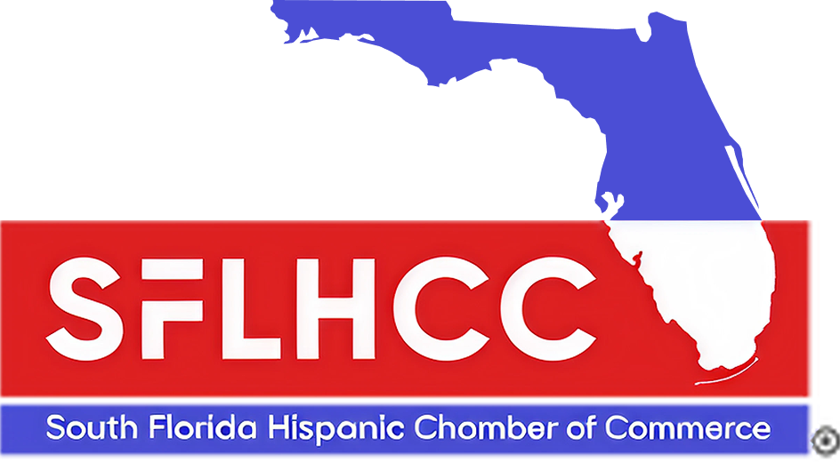

<div align="center">



# South Florida Hispanic Chamber of Commerce

${\color{#4A5BC4}\textsf{Connecting\, supporting\, and advocating for Hispanic-owned businesses across Miami-Dade and beyond.}}$

Flask 3.0 · Jinja2 · Bootstrap 5.3 · Bootstrap Icons · Google Fonts · Python 3

---

</div>

## Table of Contents

- [What is SFLHCC?](#what-is-sflhcc)
- [Features](#features)
- [Tech Stack](#tech-stack)
- [Running Locally](#running-locally) — set up a dev environment in ~2 minutes
- [Project Structure](#project-structure)

---

## What is SFLHCC?

The South Florida Hispanic Chamber of Commerce (SFLHCC) connects, supports, and advocates for Hispanic-owned businesses across Miami-Dade and beyond — helping them grow, lead, and succeed.

This repository contains the marketing website for SFLHCC, built with Flask and Bootstrap 5.

## Features

- Hero section with event photography and partner logos
- Responsive layout (mobile, tablet, desktop)
- Partnership strip — Elevate South Florida · USHCC · Wells Fargo
- Full navigation with utility links and blue main nav bar
- Playfair Display serif headings

## Tech Stack

| Layer | Technology |
|---|---|
| Web Framework | Flask 3.0 |
| Templating | Jinja2 |
| CSS Framework | Bootstrap 5.3 |
| Icons | Bootstrap Icons |
| Fonts | Google Fonts — Playfair Display |
| Runtime | Python 3 |

## Running Locally

**1. Install dependencies**

```bash
pip install -r requirements.txt
```

**2. Start the dev server**

```bash
python app.py
```

**3. Open in browser**

```
http://127.0.0.1:5000
```

> The server reloads automatically on code changes — no restart needed.

## Project Structure

```
sflhcc/
├── app.py                  # Flask application entry point
├── requirements.txt        # Python dependencies
├── static/
│   ├── css/style.css       # Custom styles (built on Bootstrap 5)
│   ├── js/main.js
│   └── images/             # Logo, hero photo, partner logos
└── templates/
    ├── base.html           # Base layout (Bootstrap, fonts, scripts)
    ├── index.html          # Page entry point
    └── sections/           # Modular section templates
        ├── navbar.html
        ├── hero.html
        ├── about.html
        ├── services.html
        ├── portfolio.html
        ├── testimonials.html
        ├── contact.html
        └── footer.html
```